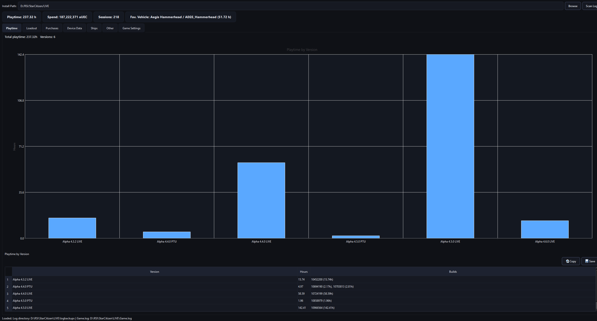
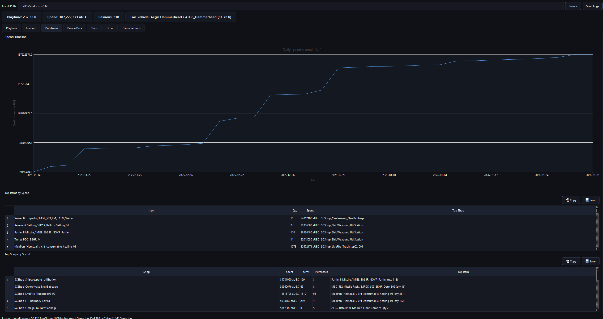
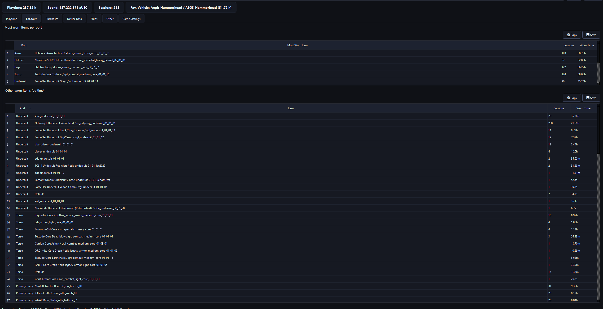

# SCStats

SCStats is a **local, read-only Star Citizen log analysis tool** that extracts gameplay
events and session statistics from the game's log files.

It runs entirely offline and does **not** interact with the game process.

## Screenshots

---

## What SCStats Does

- Analyzes local Star Citizen log files (`Game.log`, `logbackups`)
- Calculates session playtime across multiple launches
- Tracks loadout and equipment changes
- Determines favorite ingame vehicle based on flight times
- Correlates purchase requests with in-game responses
- Presents gameplay insights through a local UI

---

## Safety & Trust

SCStats is designed to be safe and transparent:

- ✅ Reads local log files only  
- ❌ No memory access  
- ❌ No injection or hooks  
- ❌ No network uploads  

All processing happens locally on your machine.
SCStats does not require Star Citizen to be running.

It does not interfere with AntiCheat software or modify the game process at all

For more details, see [docs/trust.md](docs/trust.md).
---

## Downloads

Releases are published through **GitHub Releases**.

> ⚠️ Windows may show a SmartScreen warning because the application is unsigned.
> This is expected for new, independent tools. No system settings need to be changed.

---

## Quick Start

1. Download the latest release from GitHub Releases
2. Run `SCStats-[version].exe` (no install required)
3. Select your Star Citizen installation directory
4. SCStats automatically analyzes your local log files

No configuration required.

## Support Development

SCStats is free and fully usable without payment.

If you find SCStats useful and want to support development, you can do so here:
https://ko-fi.com/maple33

---

## Disclaimer

SCStats is not affiliated with Cloud Imperium Games.
Star Citizen® is a registered trademark of Cloud Imperium Games Corp.
